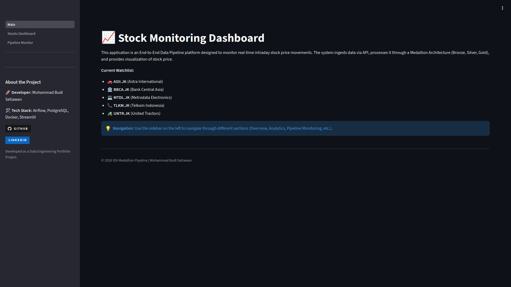
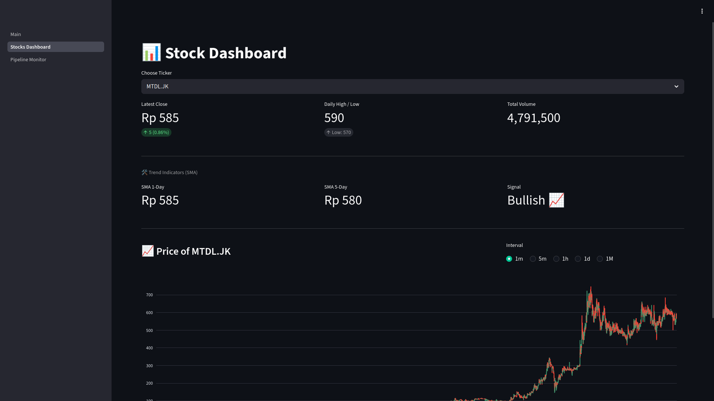
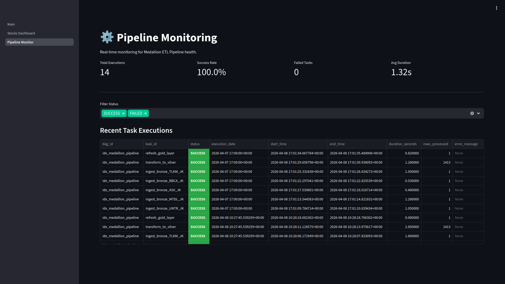

# Stock Monitoring Dashboard

End to End Data Pipeline for Stock Monitoring

Demo: [stock-monitoring.project-capstone.my.id](stock-monitoring.project-capstone.my.id)

# Overview

THis project implement medallion data architecture for monitoring price of several stock. It is using airflow for automation and streamlit for viualization.

# Dashboard Pages

- **Main**:
  
  Overview app and list of stock monitored
- **Stocks Dashboard**:
  
  Visualization of stock price and recommendation
- **Pipeline Monitoring**:
  
  Monitor stats of task airflow execution for audit

# Tech Stack

- **Orchestration**: Apache Airflow
- **Database**: PostgreSQL
- **Visualization**: Streamlit
- **Source**: Yahoo Finance API

# Medallion Arhitecture

Medallion arhitecture divide data by 3 layer (Bronze, Silver, and Gold).

- Bronze is using for raw data from Yahoo Finance.
- Silver is using for clean data from bronze.
- Gold is using for analytical data like OHLCV and monving average

# Getting Started

## Prerequisites

- Docker & Docker Compose
- Python3.12+
- PostgreSQL

## Installation & Setup

1. **Clone Repository**:

```bash
git git@github.com:budiserius/stock-monitoring-dashboard.git
cd stock-monitoring-dashboard
```

2. **Setup Database**:
   Run SQL Script in folder `postgresql/schema.sql`

3. **Change Environment**:
   - Change DB URL in `airflow/scripts/etl_logic.py` and `streamlit/.streamlit/secrets.toml`
   - Change List Saham in `airflow/dags/stock_pipeline.py`

4. **Run Airflow**:
   `docker-compose up -d`

5. **Run Streamlit Dashboard**:

```bash
cd streamlit
pip install -r requirements.txt
streamlit run Main.py
```
